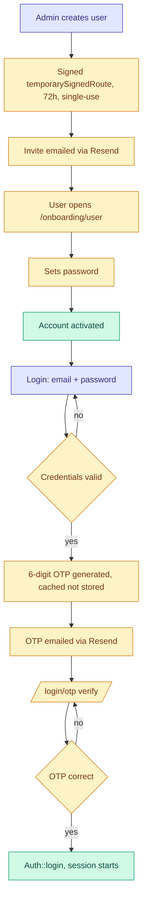
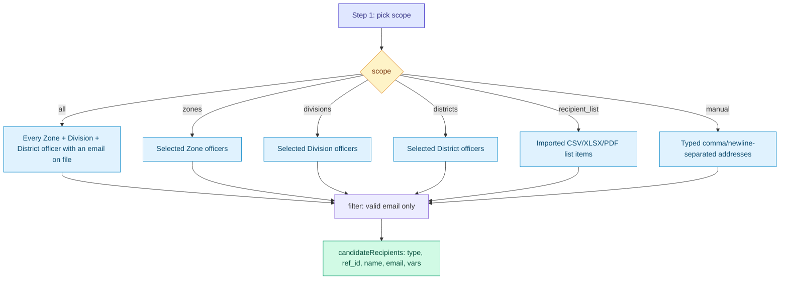
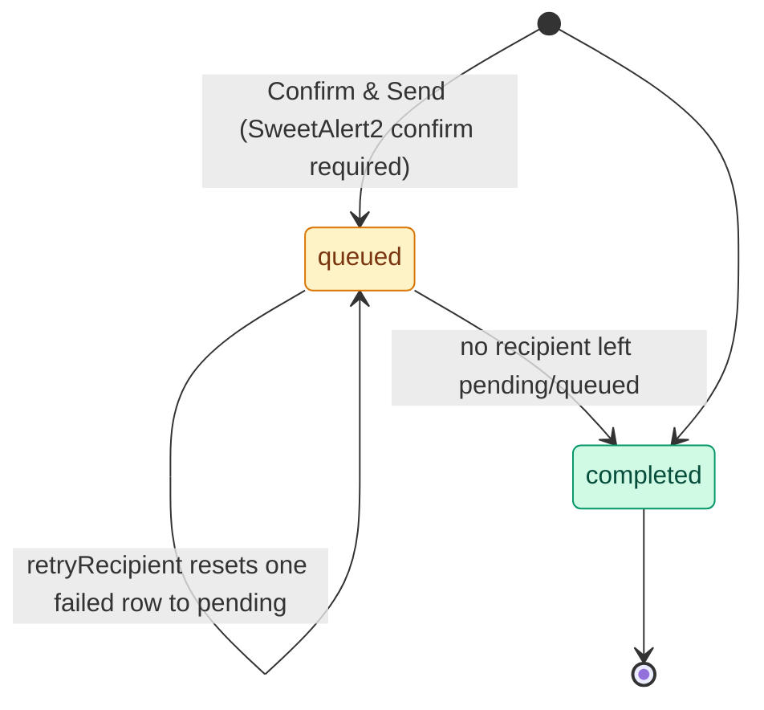
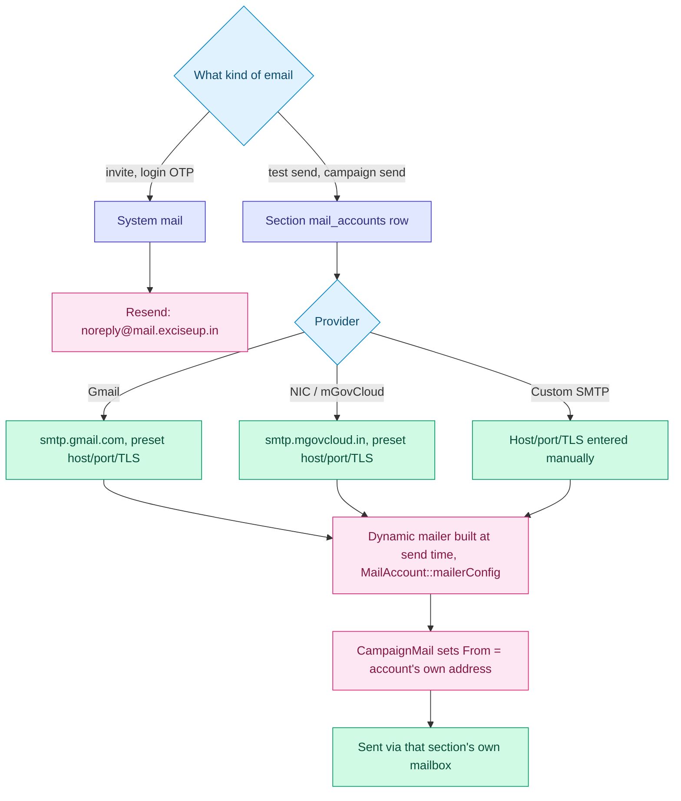
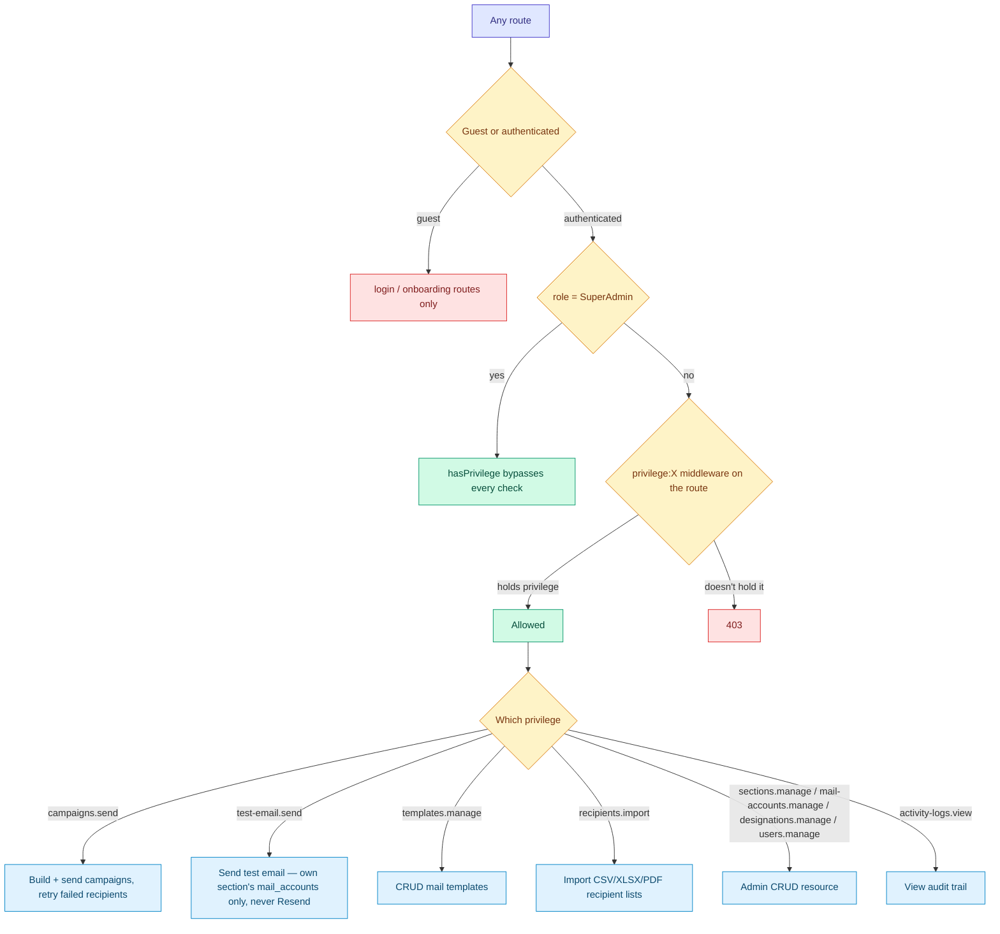
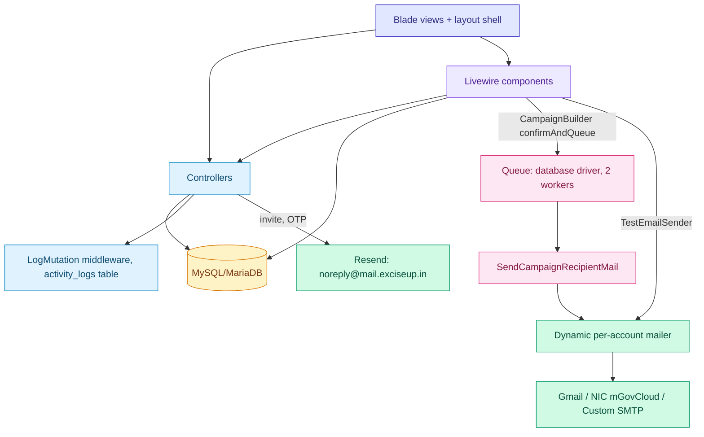

# Application Flow — Diagrams

**Date:** 2026-08-21
**Purpose:** Visual map of how this app works — auth, recipient scope resolution, campaign
send lifecycle, authorization, and the component map. Kept in its own file, same convention as
`~/Sites/pdf-markdown-pipeline/APP_FLOW.md` and `~/Sites/excise-budget-tracker/ARCHITECTURE.md`
— linked from `CLAUDE.md`.

**Legend** (colors are consistent across every diagram below, though not every diagram uses
every color):

| Color | Meaning |
|---|---|
| 🟦 Indigo | Entry point / start of a flow |
| 🟨 Amber | Pending, in-progress, or a decision node |
| 🟩 Green | Good outcome, done, or a terminal success state |
| 🟥 Red | Rejected, failed, or flagged for attention |
| 🔷 Sky blue | Scoped/authorized step, controller, or branch |
| 🟪 Purple/pink | Background job, queue, or storage layer |

## 1. Auth — invite, activate, login, OTP

Both the login attempt (`throttle:login`) and the OTP-verify endpoint (`throttle:two-factor`)
are rate-limited server-side per email+IP — a client-side resend cooldown alone is a UX nicety,
not a security boundary (see `~/Projects/excise-revenue-recovery-portal/SECURITY.md` H-01, the
reason this app was built with both throttles from the start). Fortify's own routes stay
`ignoreRoutes()`'d, called from `FortifyServiceProvider::register()` — doing that in `boot()`
instead would silently leave `/register`, `/reset-password`, `/passkeys/*` reachable (see
`excise-budget-tracker`'s `summary.md` M9 for the exploit this avoids).

## 2. Campaign builder — recipient scope resolution

`CampaignBuilder::candidateRecipients()` picks exactly one of six scopes; every branch ends in
the same `FILTER_VALIDATE_EMAIL` filter before a recipient is queueable:

`manual` recipients get `recipient_type = 'manual'`, `recipient_ref_id = null` — there's no
backing row, so `CampaignRecipient::resolveVars()` (used by retry) just returns the static
`name`/`email` already stored on that row instead of re-fetching from a relation.

## 3. Campaign send lifecycle

Each `campaign_recipients` row is its own state (`pending → sent` or `pending → failed`,
independent of the others) — `sent_at`/`failed_at` are recorded separately so a failed row shows
*when it failed*, not just a blank "Sent At". `Campaign.status` only reflects the aggregate — it
has no `sending` write path today (the column exists for it, nothing sets it); it goes
`queued → completed` once every recipient row has a terminal status. Both the success and
failure branch of `SendCampaignRecipientMail::handle()` wrap their recipient-status write +
`markCampaignCompletedIfDone()` check in one `DB::transaction()` (kept outside `Mail::send()`
itself — never hold a DB transaction open across a slow SMTP call), so a crash between the two
writes can't leave a campaign stuck showing `queued` forever with every recipient already
resolved. `retryRecipient()` does the same for its own two-write reset. `confirmAndQueue()`
guards against a second Livewire call with a `queued` bool on the component so a double-click
can't dispatch the same batch twice. Campaign URLs are slug-bound
(`Campaign::getRouteKeyName() === 'slug'`, random-suffixed) — never the row id.

`zip_per_recipient` attachment matching runs **before** this: normalize filenames + recipient
names (strip extension, slugify), try exact match → substring-containment → Levenshtein fuzzy,
then always show a confirmation table — auto-match is a convenience, not a silent default.

## 4. Mail routing — system vs. campaign

Credentials never sit in `.env` or a long-lived `config()` array — `mailerConfig()` builds the
mailer fresh from the encrypted `app_password` column at send time, inside the request/job
that's actually sending. `CampaignMail` explicitly sets `From` to the sending account's own
address (not the fixed system `MAIL_FROM_ADDRESS`) — most relays, especially NIC's mGovCloud,
reject a mismatched From outright (`553 Sender is not allowed to relay`, fixed 2026-08-20). A
relay can still throttle or block an account regardless of a correct From — see `summary.md`'s
2026-08-20 "Live incident" entry for a confirmed Zoho/mGovCloud account-level block, unrelated
to anything this app controls.

## 5. Authorization — privileges

`User::canUseMailAccount()` layers on top of `test-email.send`/`campaigns.send`: a non-SuperAdmin
can only pick a `mail_accounts` row belonging to their own `section_id`, even if they hold the
privilege — checked in `TestEmailSender`, `CampaignBuilder::confirmAndQueue()`, and
`CampaignController::prefillTestSend()`. Every non-GET authenticated request is also logged to
`activity_logs` by the global `LogMutation` middleware (not gated by any privilege — this is the
audit trail itself).

## 6. Component map

- **Livewire** (interactive flows only, per `CLAUDE.md`'s UI conventions) — `CampaignBuilder`
  (4-step wizard: recipients → template → attachments → review), `TestEmailSender`,
  `OfficerDirectoryImportWizard`, `RecipientListImportWizard`, `Dashboard`. Auth pages and admin
  CRUD stay plain Blade + controllers. Every component using `WithFileUploads`
  (`CampaignBuilder`, both import wizards) independently re-checks its own privilege inside each
  action method — Livewire's AJAX update endpoint isn't covered by the mounting route's
  middleware, only its initial `GET`.
- **Controllers** — `CampaignController`, `MailTemplateController`, `RecipientController`,
  `RecipientListController`, `Admin\{SectionController,MailAccountController,
  DesignationController,UserManagementController,ActivityLogController}`,
  `Auth\{LoginController,OnboardingController}`.
- **Queue** — `database` connection, two systemd-supervised `queue:work --tries=3
  --timeout=1900` workers (see `DEPLOY.md`); each `campaign_recipients` row becomes one job,
  `delay()`-staggered by `mail_account.throttle_seconds * index` (further staggered across days
  once `daily_send_cap` is hit).
- **MySQL/MariaDB** — `zones`/`divisions`/`districts` (fixed 5/18/75 org tree, seeded),
  `sections`/`mail_accounts`, `designations`, `users`, `activity_logs`,
  `recipient_lists`/`recipient_list_items`, `mail_templates`, `campaigns`/`campaign_recipients`.
  Full column-level detail in `CLAUDE.md`'s domain model table.

- **Middleware** — `LogMutation` (audit trail) and `SecurityHeaders` (CSP, X-Frame-Options,
  HSTS, etc. on every response, including error pages) are both registered globally in
  `bootstrap/app.php`. Custom-branded error pages (`resources/views/errors/*.blade.php`, an
  `<x-error-page>` component) replace Laravel's default Whoops/plain error views for
  401/402/403/404/419/429/500/503.

See `CLAUDE.md` for the narrative version of all of the above, `SECURITY.md` for the full
audited security posture, and `summary.md` for the dated build log each fix/feature came out of.
